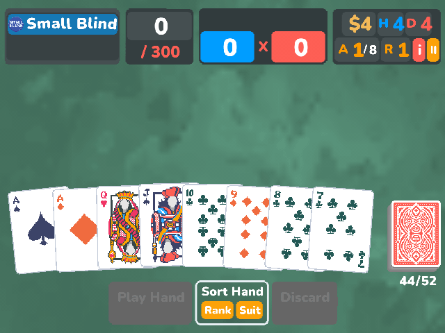

# Balatro for Miyoo Mini

Balatro for the Miyoo Mini running OnionOS. This is an early release;
performance and compatibility still need work.

Gameplay recorded on the RG35XX SP development device.

## Install

1. Download the ZIP from [Releases](https://github.com/Producdevity/balatro-miyoo-mini-port/releases) and extract its `Roms` folder to the root of your SD card.
2. Copy your own `Balatro.exe` or `Balatro.love` into `Roms/PORTS/Games/Balatro/`.
3. Refresh the Ports list and launch Balatro from Strategy.

In Steam, use Manage > Browse local files to find the game. On macOS, look
inside Balatro.app > Contents > Resources for `Balatro.love`.

Leave at least 250 MB free after copying the game. The first launch prepares
audio; let it finish. If interrupted, launch again to resume.

Saves are stored in `Saves/CurrentProfile/saves/Balatro`. Back them up before
updating.

The launcher requests 1.5 GHz through Onion's clock helper and restores the
previous clock on exit. Set `BALATRO_CPU_MHZ=off` to disable this.

## Development

See [CONTRIBUTING.md](CONTRIBUTING.md) for building, testing and SD deployment.
Technical notes cover the [architecture](docs/architecture.md),
[audio](docs/audio.md) and [performance tests](docs/performance.md).

## About

Forked from [balatro-port-tui](https://github.com/4RH1T3CT0R7/balatro-port-tui)'s
Rust compatibility runtime and CPU renderer, with rendering, audio and input
work for the Mini. The small-screen layout started with
[PortMaster](https://github.com/PortsMaster/PortMaster-New)'s adaptation.

Licensed under [GPLv3](LICENSE). Upstream credits and licenses are in
[NOTICE](NOTICE) and [licenses](licenses/README.md).
Balatro is made by LocalThunk and must be purchased separately.
